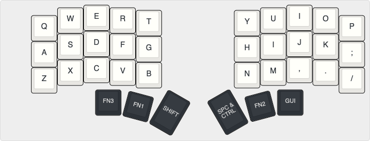
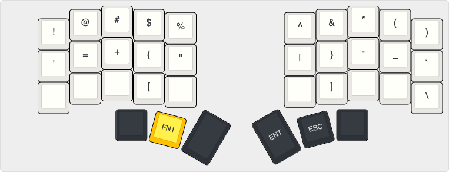
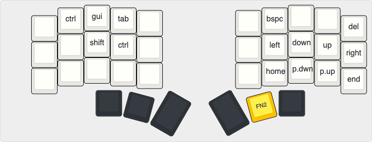
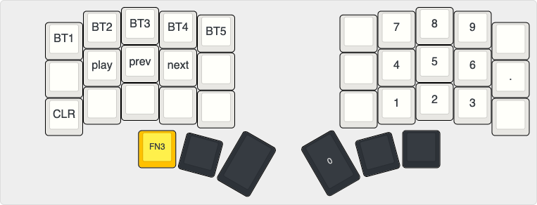

# monsieurluge's Corneish-Zen Keymap

This keymap was designed with these constraints in mind:

- the keyboard should be used as a daily driver
- as a developer I need full and easy access to some "common" symbols
- "real" numpad
- only for MacOS

What is missing or needs to be changed?

- ALT key
- lack of F1 to F12 keys

# Layout

